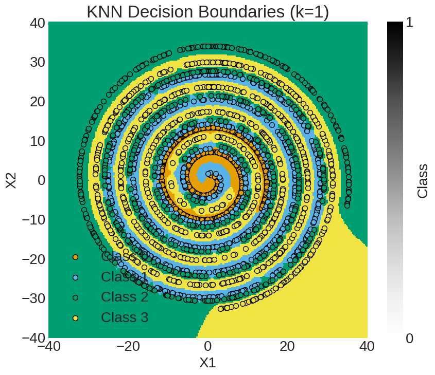
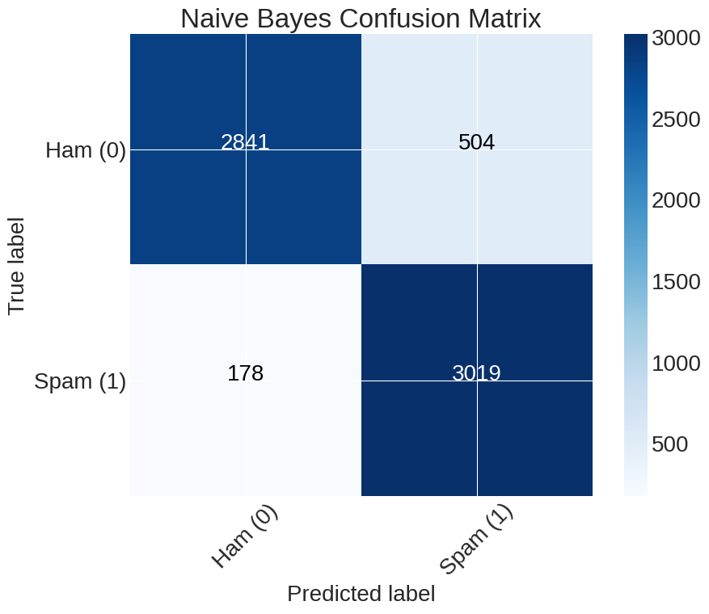

# 📧 SpamGuard: Email Spam Classification System

SpamGuard is a machine learning project that classifies emails as **spam** or **ham** using the Enron Email Dataset. Built from scratch in Python, it features a full NLP pipeline and two custom classifiers: **Naive Bayes** and **K-Nearest Neighbors (KNN)**.

---

## 🧠 Overview

This project demonstrates an end-to-end machine learning workflow using real-world text data (~34,000 emails). It includes preprocessing, feature engineering, model implementation, and performance evaluation.

- **Tech Stack:** Python, NumPy, pandas, scikit-learn  
- **Algorithms:** Naive Bayes, K-Nearest Neighbors  

---

## 🔍 Features

- ✅ Implementation of Naive Bayes and KNN
- ✅ Complete NLP pipeline:
  - Tokenization
  - Stopword removal
  - Normalization
  - Vectorization
- ✅ Model evaluation using:
  - Confusion matrix
  - Accuracy, Precision, Recall, F1-score
  - K-fold cross-validation
- ✅ Multi-metric comparison of model performance

---

## 📊 Results

- 📈 **Naive Bayes accuracy:** ~89.6%
- 📈 **KNN accuracy:** Similar, with higher compute cost on large datasets
- 📉 Confusion matrices used to analyze misclassifications

<div align="center">
  
  
</div>

## 🛠️ Setup

```
# 1. Clone the repo
git clone https://github.com/NDelan/spam-guard.git
cd spam-guard

# 2. (Optional) Create and activate a virtual environment
python -m venv venv
source venv/bin/activate  # Windows: venv\Scripts\activate

# 3. Install dependencies
pip install -r requirements.txt

# 4. Download the Enron dataset and place it inside the `data/` folder
```

---
## 🚀 Run the Notebooks
```
Launch Jupyter Notebook or VS Code and open:

- `knn/knn.ipynb` — K-Nearest Neighbors implementation and results  
- `naive_bayes/naive_bayes.ipynb` — Naive Bayes implementation and results  
- `spam_email_preprocessing.ipynb` — Text preprocessing steps
```
---

## 📁 Project Structure
```
spamguard/
├── knn/
│   ├── knn.py
│   ├── knn.ipynb
├── naive_bayes/
│   ├── naive_bayes.py
│   ├── naive_bayes.ipynb
├── data/
│   └── enron/...
├── spam_email_preprocessing.ipynb
├── email_preprocessor.py
├── classifier.py
├── README.md
└── requirements.txt
```
---

## 📝 Acknowledgments

- [Enron Email Dataset](https://www.cs.cmu.edu/~enron/) by Carnegie Mellon University  

---

## 📄 License

This project is licensed under the MIT License. See [`LICENSE`](LICENSE) for details.
